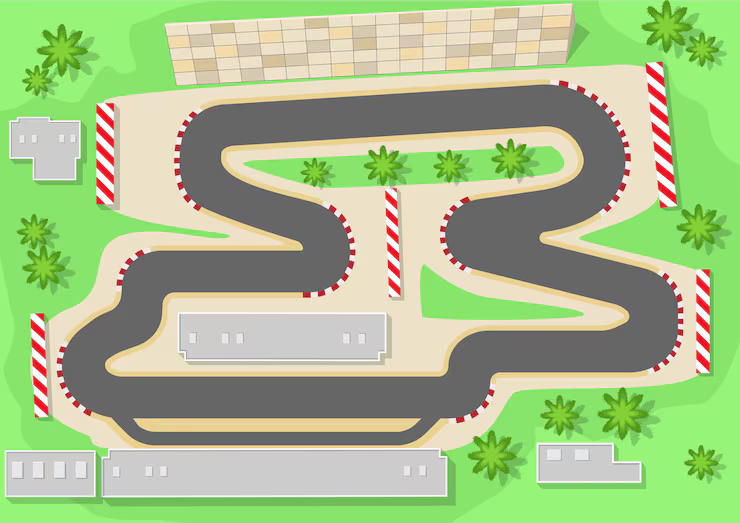

# Self-Driving Car Neuroevolution (NEAT + Pygame)

> Evolving tiny neural networks to drive a car around a spline‑generated track in real time.



## ✨ Project Overview
This project demonstrates an always-on / continuous evolution loop using the NEAT (NeuroEvolution of Augmenting Topologies) algorithm to teach simple feed-forward neural networks to drive a car around a procedural 2D track.

Instead of running fixed generations with a full population replacement, this setup evolves *on the fly*: once an agent (car) dies or times out, it is immediately replaced by a new genome bred from the current elite pool. This creates a fluid, arcade-like training visualization.

### Why It's Interesting
- **Continuous evolution** (steady-state style) rather than batch generations.
- **Spline-based track generation** using a Catmull–Rom chain for smooth curvature.
- **Lightweight sensor model**: 7 distance rays + speed fed directly into a 3-output controller (steer / throttle / brake).
- **Shaping rewards** encourage forward motion, alignment with track tangent, checkpoint (gate) traversal, and penalize spinning or going off-road.
- **Minimal dependencies** and <500 lines of readable code.

## 🧠 Core Concepts
| Component | Description |
|-----------|-------------|
| `env.CarEnv` | Simulated driving environment with track mask, gates, sensors, and reward logic. |
| Sensors | 7 raycasts (±75° spread) + normalized speed → 8-D observation vector. |
| Actions | `[steer, throttle, brake]` each in range roughly `[-1..1]` or `[0..1]`. |
| Fitness | Accumulated shaped reward + implicit distance. Crashes incur a heavy penalty. Gate crossings grant large bonuses. |
| Replacement Strategy | When a car dies or exceeds `MAX_STEPS`, a child genome is produced via crossover + mutation of two elites. |
| Elites | Top genomes maintained in a rolling list (`ELITE_SIZE`). |

## 📁 Repository Structure
```
├── train.py            # Continuous evolution loop & visualization
├── env.py              # Car environment, physics, sensors, rewards, track & gates
├── config_neat.ini     # NEAT hyperparameters
├── requirements.txt    # Dependencies
├── track.png           # Track / background preview (used in README)
├── car-top*.png        # (Optional) Car sprite images (currently using generated rectangles)
└── saved/
    └── best_genome.pkl # (If present) Serialized top genome for later reuse
```

## ⚙️ NEAT Configuration Highlights
Key parameters from `config_neat.ini`:
- Population size (`pop_size`): 100 (but runtime loop maintains its own steady-state subset `POP_SIZE=20`)
- Activation functions: `sigmoid`, `tanh`, `relu` (default: `tanh`)
- Structural mutations: `conn_add_prob=0.5`, `node_add_prob=0.2`
- Speciation via compatibility threshold: `3.0`
- Elitism + survival thresholds retain strong performers while allowing exploration.

> Note: The in-code loop manages its own mini population and *doesn't* call `neat.Population.run`; it manually instantiates genomes and networks, mutating on replacement.

## 🚀 Getting Started
### 1. Clone / Download
(Adjust if you forked or renamed):
```bash
# Windows PowerShell (example)
git clone <your-repo-url> self-driving-neat
cd self-driving-neat
```

### 2. Create & Activate a Virtual Environment (Recommended)
```powershell
python -m venv .venv
. .venv/Scripts/Activate.ps1
```

### 3. Install Dependencies
```powershell
pip install -r requirements.txt
```

### 4. Run the Evolution Loop
```powershell
python train.py
```
Close the window or press the standard window close button to terminate.

## 🕹️ Controls / Interaction
There is no manual control in the main loop—agents are fully autonomous. To add human override or hybrid training, you could inject keyboard events inside the loop before `net.activate(obs)`.

## 🔍 Observation & Action Details
- Observation vector length = 8:
  - 7 normalized ray distances (each ∈ [0, ~1], after dividing by max range 150*4)
  - 1 normalized speed term (speed / `MAX_SPEED`)
- Action vector length = 3:
  - `steer` (−1 .. 1) → angular velocity scaling
  - `throttle` (0 .. 1)
  - `brake` (0 .. 1)

## 🏁 Reward Shaping Breakdown
| Component | Effect |
|----------|--------|
| Forward alignment | Small positive reward for velocity aligned with local track tangent |
| Speed term | Encourages movement, scaled by current speed |
| Survival bonus | Tiny +0.02 per step to avoid premature stagnation |
| Gate crossing | +200 per checkpoint to enforce progress |
| Crash / off track | −200 and terminates episode |
| Spinning penalty | −0.5 when steering hard while nearly stationary |
| Stagnation kill | Terminates if no fitness improvement for `MAX_STEPS_WITHOUT_IMPROVEMENT` |

## 📊 On-Screen HUD
Top-left overlay displays:
- Current generation counter (incremented each full loop)
- Alive agents
- Current best fitness (among alive)
- Average fitness (alive)

A rolling `fitness_history` buffer (length `GRAPH_HISTORY`) is retained internally—you can easily add a mini line graph if desired.

## 💾 Saving / Loading Best Genome
Currently the loop collects elites in-memory. To persist the best genome, you can add:
```python
import pickle
with open('saved/best_genome.pkl', 'wb') as f:
    pickle.dump(best_genomes[0], f)
```
Later, recreate its network via:
```python
with open('saved/best_genome.pkl', 'rb') as f:
    genome = pickle.load(f)
net = neat.nn.FeedForwardNetwork.create(genome, config)
```
(You might adapt the code to periodically auto-save.)

## 🧪 Possible Extensions
- Add mini-map or scrolling camera
- Visualize sensor rays dynamically
- Replace rectangle car with rotation-correct sprite (`car-top.png`)
- Curriculum: progressively tighter tracks
- Add friction zones, obstacles, or moving hazards
- Introduce recurrent connections (set `feed_forward=False`)
- Multi-objective fitness (speed vs safety vs smoothness)
- Hybrid human demonstration seeding

## 🛠️ Troubleshooting
| Issue | Cause | Fix |
|-------|-------|-----|
| Pygame window not opening | Missing display / driver | Ensure local desktop environment (not pure headless) |
| All agents die instantly | Sensors mis-scaled / off-track spawn | Verify spawn offset logic & track mask alignment |
| No improvement | Reward too sparse | Tune gate reward or add intermediate progress reward |
| Exploding weights | Mutation too aggressive | Lower `weight_mutate_power` or `conn_add_prob` |

## 🧾 License
Add your preferred license (e.g., MIT) here.

## 🙌 Attribution
- NEAT implementation: [`neat-python`](https://github.com/CodeReclaimers/neat-python)
- Inspired by classic neuroevolution driving demos.

## 🎬 Demo Video
Below is an embedded MP4 of a live training session (stored in the repo as `2.mp4`). GitHub will usually show it as a downloadable file; some browsers will play it inline. If it does not auto‑embed, use the direct link below or convert a short clip to a GIF.

<p align="center">
  <video src="2.mp4" width="640" controls loop muted playsinline style="border:1px solid #444; border-radius:8px; box-shadow:0 4px 18px rgba(0,0,0,0.35);"></video>
</p>

### Alternate Access
- Direct file: [`2.mp4`](2.mp4)
- (Optional) Optimized GIF (generate with `ffmpeg`):
  ```powershell
  ffmpeg -i 2.mp4 -vf "fps=20,scale=640:-1:flags=lanczos" -t 12 demo.gif
  ```
  Then embed:
  ```markdown
  
  ```

### Tip: Reduce File Size
If the MP4 is large, you can compress it:
```powershell
ffmpeg -i 2.mp4 -vcodec libx264 -crf 28 -preset veryfast -an 2_compressed.mp4
```
Lower `-crf` = higher quality (default range ~18–30). Add audio track only if needed.

---
**Enjoy evolving tiny drivers!** Feel free to open issues or ideas for improvements.
